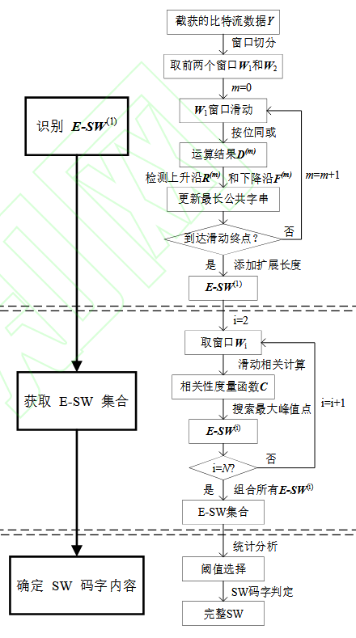

# 同步字盲识别算法

## 基于两次窗口滑动运算的非等长帧同步字盲识别

特点：能够识别等长帧和非等长帧结构，可以识别出同步字完整码字，识别速度较快。

### 一、算法框架

### 二、详细实现原理

#### 1、识别$E-SW^{(1)}$

- 数据帧结构表示如下：

  

- 对截获的数据进行窗口切割，切割窗口尽量长，至少包含完整同步字。

  - M个码长的数据可以切割为M/K(向下取整)个窗

  

  - 滑动窗口$W_1$，并将窗口做同或运算，当同步字对齐时可以得到连1(同步字无误码情况下)

  

  - 实际情况下，数据在传输过程中会出现误码，则出现以下情况

  

  - 定义一种方法，将个别误码视为候选同步字

    论文中的方法：重新定义上升沿和下降沿
    $$
    R ^{m}=\left\{\delta_r\middle|\sum\limits_{j=\delta_r-J}^{\delta_r-1}D^{(m)}(j)<\eta_1\&\sum\limits_{j=\delta_r}^{\delta_r+J-1}D^{(m)}(j)>\eta_2,\delta_r\in[J+1,K-J+1]\right\}
    $$

    $$
    F^{m}=\left\{\delta_f\middle|\sum\limits_{j=\delta_f-J+1}^{\delta_f}D^{(m)}(j)>\eta_2\&\sum\limits_{j=\delta_f+1}^{\delta_f+J}D^{(m)}(j)<\eta_1,\delta_f\in[J,K-J]\right\}
    $$

    ​	$R^{(m)}$ 和 $F^{(m)}$ 分别表示滑动位移为 m 时对应的上升沿和下降沿集合; $δ_r$ 和 $δ_f $分别表示上升沿和下降沿对应的位置坐标；$J$代表可容纳错误的范围；η1 和 η2 分别为下降沿阈值和上升沿阈值。 η1 一般选取略大于$J/2$ (向上取整)的数, η2 一般选取略小于 $J$ 的数。

    这样设置的可以容许一定的误码，并且候选同步字的长度会大于真实同步字的长度，为确保同步字选取准确，可在候选同步字两端增加扩展长度，确保同步字一定在候选项中。

#### 2、获取扩展同步字（E-SW）集合

- 将$E-SW^{(1)}$作为参考窗口，滑动匹配其余窗口做相关得到对应的$E-SW^{(i)}$，来得到扩展同步字集合。

  相关性度量函数表示如下：
  $$
  C({\bf{W}}_i,n)=\frac{1}{L_e}\sum\limits_{t=1}^{L_e}e_t^{(1)}\odot w_{t+n}^{(i)},n\in[0,K-L_e]
  $$
  当同步字对齐时会出现峰值：

  

  从峰值的起点取参考窗口等长序列作为该窗口的扩展同步字。以此类推。

#### 3、确定SW内容

- 已获得的E-SW集合
  $$
  \gamma = \begin{bmatrix}E-SW^{(1)}\\E-SW^{(2)}\\\vdots\\E-SW^{(N)}\end{bmatrix}
  $$
  对其逐列求和：
  $$
  \gamma=\frac{1}{N}\begin{bmatrix}\sum\limits_{i=1}^N e_1^{(i)}&\sum\limits_{i=1}^N e_2^{(i)}&\cdots&\sum\limits_{i=1}^N e_{L_e}^{(i)}\end{bmatrix}=\begin{bmatrix}r_1&r_2&\cdots&r_{L_e}\end{bmatrix}
  $$
  在无误码的情况下,可变域的取值接近于 0.5，而固定域的取值为 0 或 1。但是由于存在误码的影响，固定域内的若干码字会出现错误,导致固定域的$\gamma_{sum}$取值接近但不等于 0 或 1,此时就需要合适的阈值来判断某位置是否为固定域并确定其码字内容。

  类似以下情况：

  

### 三、总结

识别准确率的影响因素：

- 截取窗口个数，截取窗口个数越多(每个窗口包含多个同步字的情况下)，识别结果越准确。
- 误码率高的情况下，对候选同步字的选取影响较大，进而影响识别准确率。

